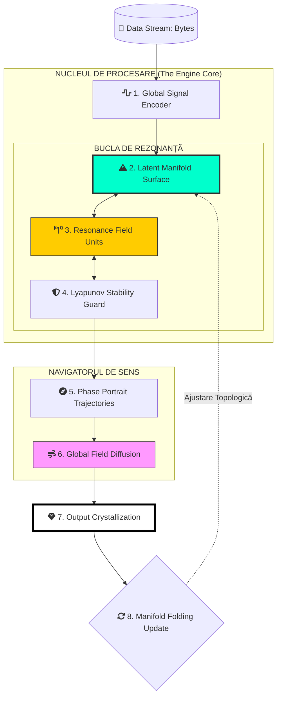

```mermaid
graph TD
    %% Intrarea de date
    RAW[(🌊 Data Stream: Bytes)] --> GSE[fa:fa-wave-square 1. Global Signal Encoder]

    subgraph "NUCLEUL DE PROCESARE (The Engine Core)"
        GSE --> MANIFOLD[fa:fa-mountain 2. Latent Manifold Surface]
        
        subgraph "BUCLA DE REZONANȚĂ"
            MANIFOLD <--> RFU[fa:fa-broadcast-tower 3. Resonance Field Units]
            RFU <--> LYAP[fa:fa-shield-alt 4. Lyapunov Stability Guard]
        end
    end

    subgraph "NAVIGATORUL DE SENS"
        LYAP --> PHASE[fa:fa-compass 5. Phase Portrait Trajectories]
        PHASE --> DIFF[fa:fa-wind 6. Global Field Diffusion]
    end

    %% Ieșirea și Feedback-ul
    DIFF --> CRYSTAL[fa:fa-gem 7. Output Crystallization]
    CRYSTAL --> FEEDBACK{fa:fa-sync 8. Manifold Folding Update}
    FEEDBACK -.-> |"Ajustare Topologică"| MANIFOLD

    style MANIFOLD fill:#00ffcc,stroke:#333,stroke-width:3px
    style RFU fill:#ffcc00,stroke:#333
    style DIFF fill:#f9f,stroke:#333
    style CRYSTAL fill:#fff,stroke:#000,stroke-width:4px
```
