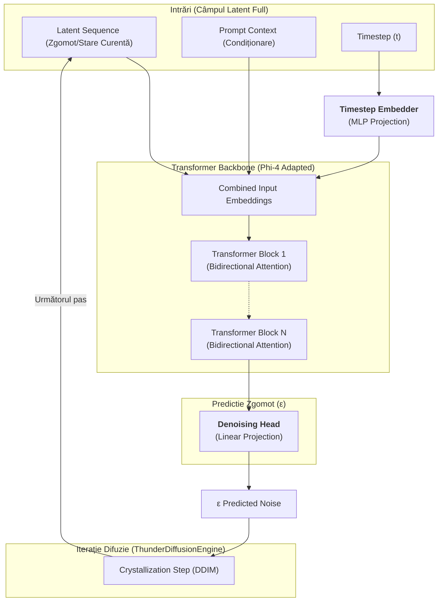

# Arhitectura Transformerului în Thunder Diffusion Engine

Această diagramă ilustrează transformarea modelului LLM (ex: Phi-4) dintr-un model autoregresiv cauzal într-un backbone de difuzie non-cauzal ("All-at-Once").

## Modificări Cheie

1.  **Global Field Coupling (Non-Causal Attention)**: S-a eliminat masca cauzală (`is_causal = False`), permițând fiecărui token să vadă întregul câmp latent simultan.
2.  **Timestep Embedding**: Un nou modul ([TimestepEmbedder](file:///Users/adriantucicovenco/Proiecte/thunder/core/model_adapter.py#5-22)) injectează informația despre etapa de difuzie în model.
3.  **Denoising Head**: O proiecție finală care mapează stările ascunse ale Transformerului înapoi în spațiul de zgomot (epsilon prediction).

## Diagrama Arhitecturii

## Fluxul de Date

1.  **Input**: Modelul primește întregul secvență de latenți (inițial zgomot alb).
2.  **Condiționare**: Timestep-ul `t` este proiectat în spațiul latent și adăugat la embeddings.
3.  **Procesare**: Transformerul procesează întregul câmp prin atenție bidirecțională (Full Field Attention), nu token-cu-token.
4.  **Predicție**: [DenoisingHead](file:///Users/adriantucicovenco/Proiecte/thunder/core/model_adapter.py#23-33) extrage predicția de zgomot $\epsilon$.
5.  **Rafinare**: [ThunderDiffusionEngine](file:///Users/adriantucicovenco/Proiecte/thunder/core/diffusion_engine.py#5-87) folosește predicția pentru a scădea zgomotul conform algoritmului DDIM, regenerând starea curentă pentru pasul următor.

{'loss': 8.9445, 'grad_norm': 3.175079584121704, 'learning_rate': 9.947465247446941e-05, 'epoch': 0.06}

{'loss': 10.0559, 'grad_norm': 3.610646963119507, 'learning_rate': 9.926451671207985e-05, 'epoch': 0.06}

{'loss': 11.6379, 'grad_norm': 6.065850257873535, 'learning_rate': 9.905438419749576e-05, 'epoch': 0.06}

{'loss': 7.0516, 'grad_norm': 3.484705686569214, 'learning_rate': 9.8844255858637e-05, 'epoch': 0.06}

{'loss': 10.7386, 'grad_norm': 3.7261548042297363, 'learning_rate': 9.863413262340491e-05, 'epoch': 0.06}

{'loss': 7.4334, 'grad_norm': 4.9783806800842285, 'learning_rate': 9.842401541967837e-05, 'epoch': 0.06}

