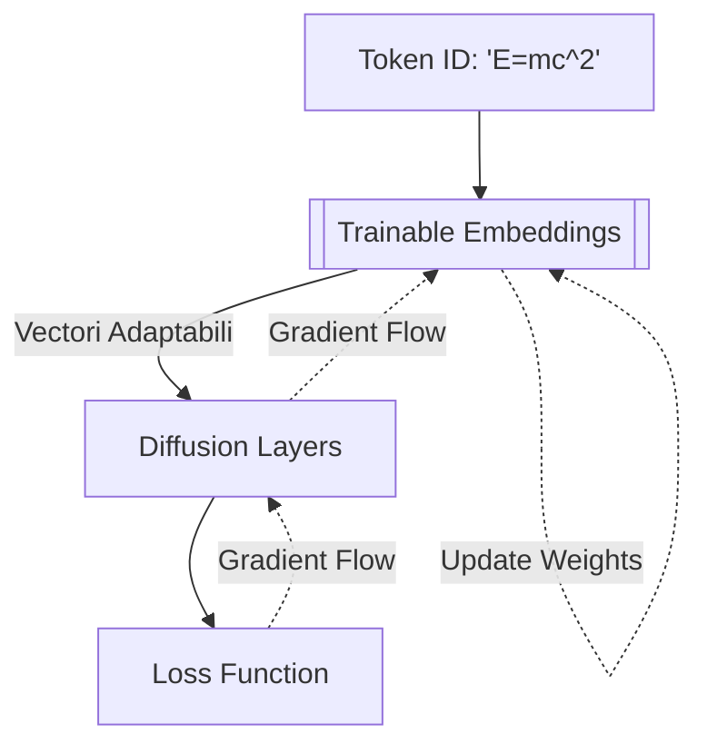

```mermaid
graph TD
    A[Token ID: 'E=mc^2'] --> B[[Trainable Embeddings]]
    B -->|Vectori Adaptabili| C[Diffusion Layers]
    C --> D[Loss Function]
    D -.->|Gradient Flow| C
    C -.->|Gradient Flow| B
    B -.->|Update Weights| B
```